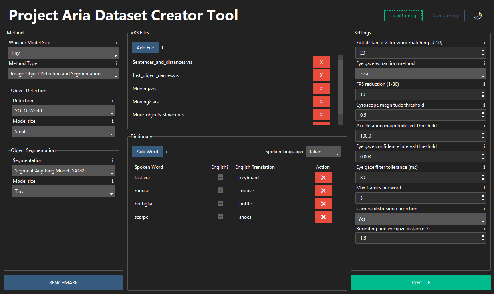
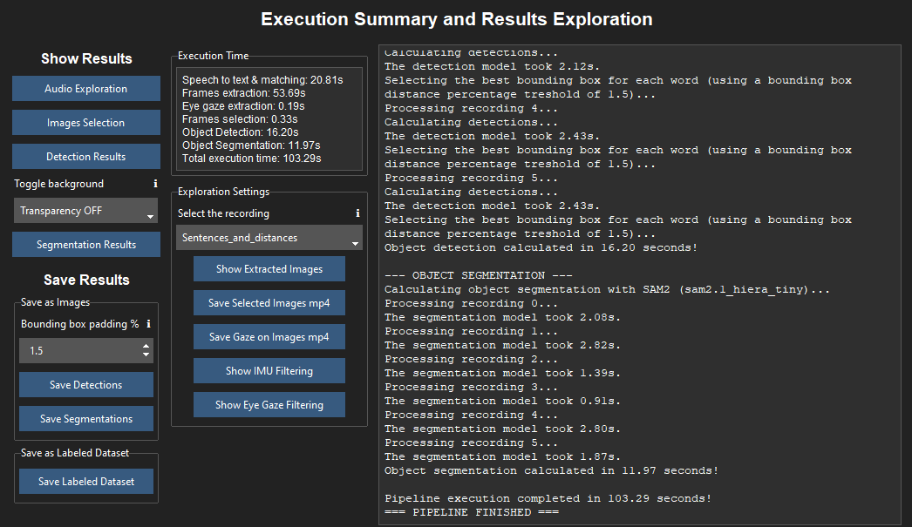
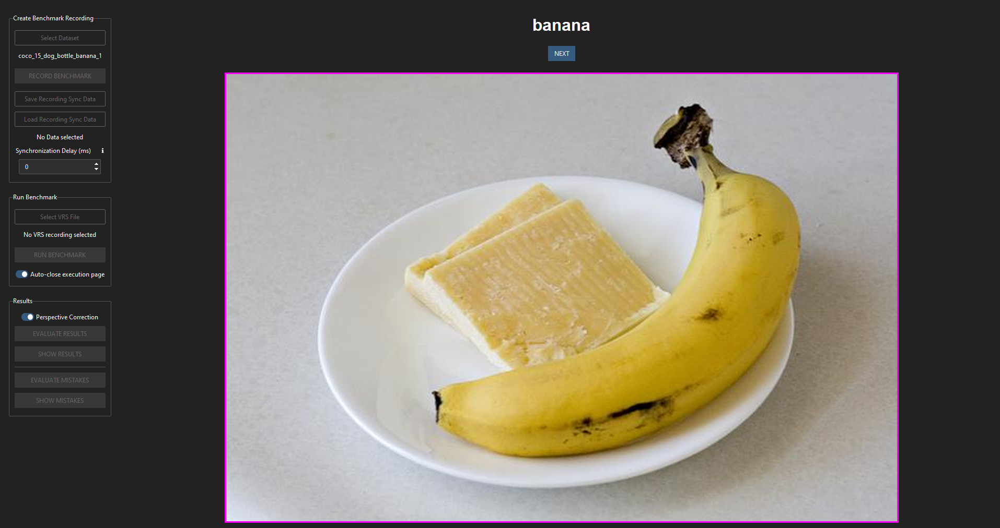
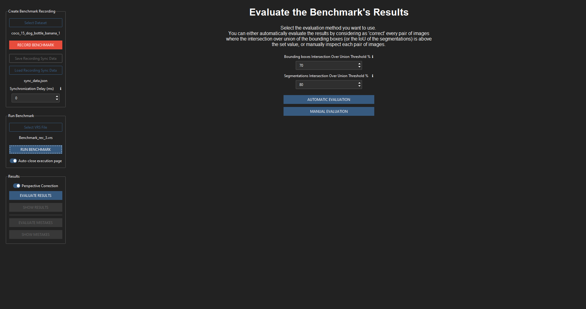
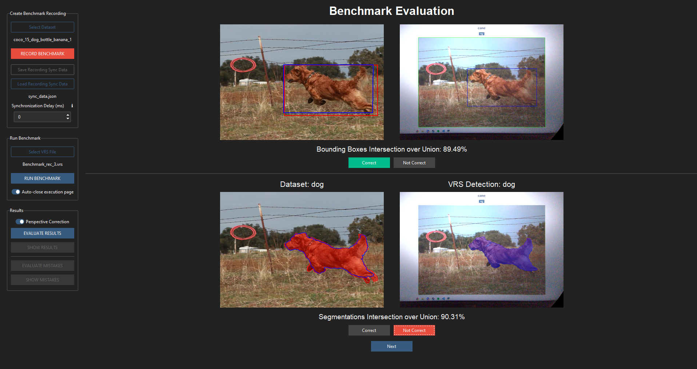
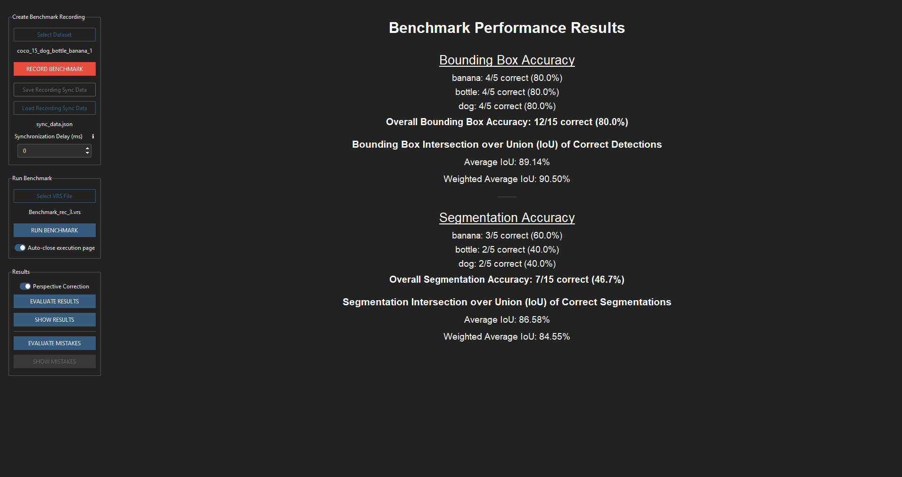
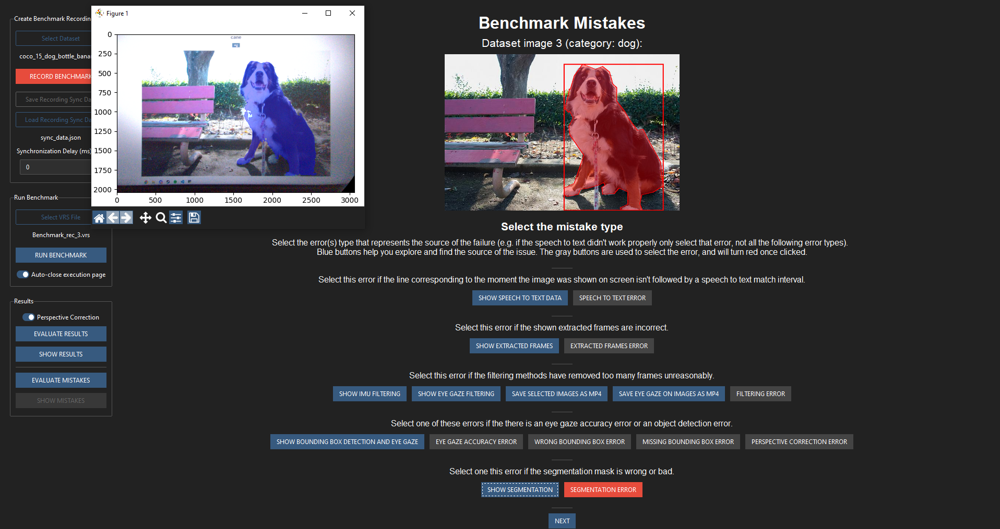
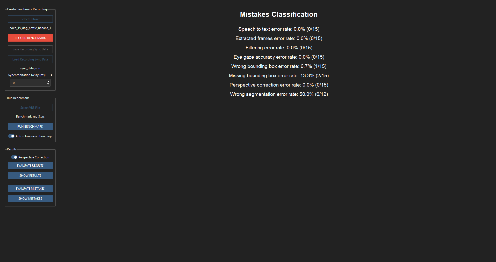

# A Multimodal Pipeline for Automated Egocentric Dataset Creation and Annotation

This is my Master’s Thesis's work (Computer Science - University of Milano-Bicocca): an automated pipeline that generates annotated egocentric datasets from Meta Project Aria glasses by synchronizing speech, gaze, and video, enabling hands-free, natural-language labeling using WhisperX, YOLO-World, and SAM2.

## Table of Contents
- [A Multimodal Pipeline for Automated Egocentric Dataset Creation and Annotation](#a-multimodal-pipeline-for-automated-egocentric-dataset-creation-and-annotation)
  - [Table of Contents](#table-of-contents)
  - [Overview](#overview)
  - [Pipeline Architecture](#pipeline-architecture)
  - [Evaluation Results](#evaluation-results)
    - [Detection \& Segmentation Accuracy](#detection--segmentation-accuracy)
    - [Error Analysis](#error-analysis)
    - [Computational Performance](#computational-performance)
  - [User Interface](#user-interface)
    - [Benchmark UI](#benchmark-ui)
  - [Conclusion](#conclusion)

## Overview

This system automates egocentric dataset creation by turning natural human behavior into labeled data: users simply look at objects and say their names while wearing Meta Project Aria glasses. The pipeline synchronously captures RGB video, eye gaze, audio, and inertial motion to generate pixel-accurate object annotations, entirely without manual labeling. Powered by WhisperX (speech), YOLO-World (open-vocabulary detection), and SAM2 (temporal segmentation), it transforms raw egocentric recordings into structured, high-quality datasets ready for training vision and activity recognition models. Scalable, efficient, and controlled via an intuitive interface.

## Pipeline Architecture

The end-to-end pipeline integrates five core stages:

1. **Speech Processing**: WhisperX transcribes audio into word-level segments with precise timestamps and confidence scores. Keywords are matched against a configurable multilingual dictionary using length-normalized edit distance for robustness.
2. **Frame Extraction**: Frames are extracted from the front RGB camera within speech intervals at a user-defined rate. Devignetting and optional fisheye distortion correction are applied using calibrated parameters.
3. **Eye Gaze Estimation**: Gaze direction (yaw/pitch) is derived from grayscale eye-camera images using either a local model or Meta’s Machine Perception Services (MPS). Uncertainty bounds are used to filter unreliable estimates.
4. **Frame Filtering**: Motion-based filtering (using IMU gyroscope and jerk data) removes frames with excessive motion. Gaze-based filtering excludes frames where gaze confidence exceeds a threshold.
5. **Object Detection & Segmentation**: 
   - **YOLO-World** detects objects using natural language prompts (e.g., “banana”, “bottle”) without fixed categories.
   - **SAM2** generates pixel-accurate masks using detection boxes as spatial prompts, optionally augmented by gaze points inside the box. Video-based segmentation was found ineffective due to computational cost and prompt overwriting.

The final dataset output can be either made out of cropped bounding box images, transparent segmentation masks, or full frames with COCO-style JSON annotations.

## Evaluation Results

### Detection & Segmentation Accuracy

Performance was evaluated on a benchmark dataset containing 100 images across 5 categories from the COCO 2017 dataset, using two pipeline configurations, *Benchmark Small* (smaller models) and *Benchmark Large* (larger models), using Intersection over Union (IoU) against the detection and segmentation ground truth.

The benchmark works by recording the monitor with the glasses, where the tool's benchmark UI shows each image one at the time, together with the label. The user simply has to say the category out loud, while looking at the object in the shown image.

**Table 1: Object Detection and Segmentation Results Across Benchmarks**

| Object Class         | Detection (Small)  | Detection (Large)  | Segmentation (Small) | Segmentation (Large) |
| -------------------- | ------------------ | ------------------ | -------------------- | -------------------- |
| banana               | 9/20               | 14/20              | 10/20                | 14/20                |
| bird                 | 20/20              | 19/20              | 19/20                | 19/20                |
| bottle               | 16/20              | 17/20              | 15/20                | 16/20                |
| dog                  | 20/20              | 20/20              | 19/20                | 19/20                |
| tv                   | 18/20              | 19/20              | 15/20                | 15/20                |
| **Overall Accuracy** | **83/100 (83.0%)** | **89/100 (89.0%)** | **78/100 (78.0%)**   | **83/100 (83.0%)**   |
| **Average IoU**      | 87.60%             | 90.47%             | 85.36%               | 86.21%               |
| **Weighted Avg IoU** | 90.43%             | 92.33%             | 86.56%               | 85.75%               |

> **Key Observations**:  
> - **Detection accuracy improved significantly with larger models**, especially for visually ambiguous classes like *banana* (+20% absolute accuracy).  
> - **Segmentation accuracy closely followed detection quality**, indicating that accurate bounding boxes are more critical than advanced mask generation.  
> - Overall segmentation accuracy rose from 78% to 83% when moving from *Small* to *Large*, primarily due to better detection prompts.

### Error Analysis

Error types were classified across the 100 images to identify pipeline bottlenecks.

**Table 2: Error Rate Classification Across Benchmarks**

| Error Type             | Small (%) | Large (%) |
| ---------------------- | --------- | --------- |
| Speech to text         | 0.00%     | 0.00%     |
| Extracted frames       | 0.00%     | 0.00%     |
| Filtering              | 1.00%     | 1.00%     |
| Eye gaze accuracy      | 0.00%     | 0.00%     |
| Wrong bounding box     | 3.03%     | 3.03%     |
| Missing bounding box   | 13.13%    | 7.07%     |
| Perspective correction | 0.00%     | 0.00%     |
| Wrong segmentation     | 6.97%     | 6.52%     |

> **Key Insights**:  
> - **Missing bounding boxes** were the dominant failure mode in *Small* (13.13%), nearly halving in *Large* (7.07%).  
> - **Wrong segmentations** often stemmed from mis-segmenting the *display screen* (where benchmark images were shown), not the target object, or from glare and contrast issues of the monitor's recording.

### Computational Performance

Processing time was measured end-to-end for both configurations.

**Table 3: Execution Time Comparison (seconds)**

| Task                      | Small (s)  | Large (s)  | Increase |
| ------------------------- | ---------- | ---------- | -------- |
| Speech to text & matching | 43.43      | 45.54      | +5%      |
| Frames extraction         | 49.14      | 48.87      | -1%      |
| Eye gaze extraction       | 116.16     | 0.04       | -99.97%* |
| Frames selection          | 0.56       | 0.68       | +21%     |
| Object Detection          | 9.74       | 17.57      | +80%     |
| Object Segmentation       | 44.29      | 230.22     | +420%    |
| **Total**                 | **263.41** | **343.01** | **+30%** |

> \* *Eye gaze extraction only has to be performed once, so it wasn't repeated for the benchmark with the larger pipeline's configuration.*

> **Key Insight**:  
> - While **YOLO-World Large** improved detection accuracy, it doubled runtime (while still remaining relatively inexpensive).  
> - **SAM2 Large** increased segmentation time by 5x with only marginal IoU gains (85.36% → 86.21%), revealing **diminishing returns**.  

## User Interface

### Benchmark UI

## Conclusion

This work demonstrates a practical, high-accuracy pipeline for automated egocentric dataset creation, enabling rapid advancement in assistive AI and activity recognition systems.

Work by Matteo Breganni - Computer Science Master's Thesis - University of Milano-Bicocca